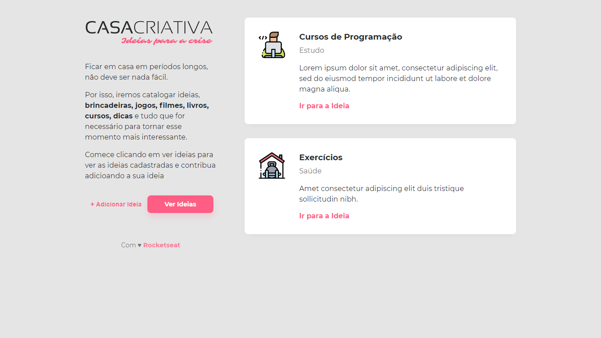
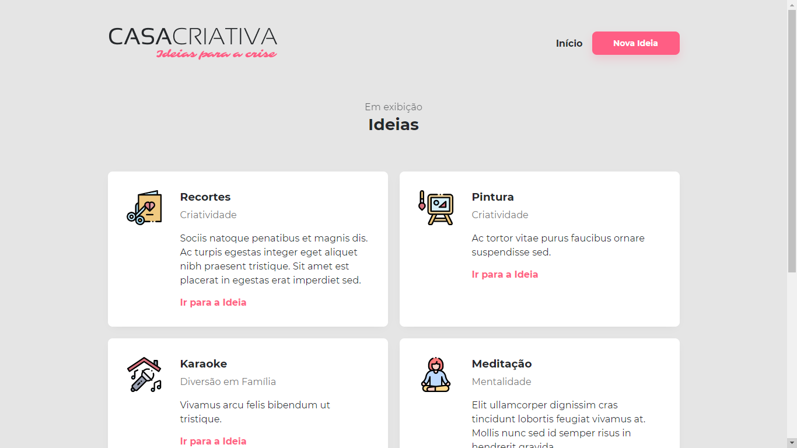

<p align="center">Projeto desenvolvido no WorkshopDev da semana OmniStack 11.0 da Rocketseat.</p>

## Sobre o projeto

A ideia do projeto é construir uma aplicação para anotar ideias para se fazer durante a crise do Coronavirus.

## Dependências

- [express](https://www.npmjs.com/package/express)
- [nunjucks](https://www.npmjs.com/package/nunjucks)
- [sqlite3](https://www.npmjs.com/package/sqlite3)

## Dependências de desenvolvimento

- [nodemon](https://www.npmjs.com/package/nodemon)

## Como iniciar

Faça um clone desse repositório e acesse a pasta WorkshopDev:

```
git clone https://github.com/DouglasVarollo/WorkshopDev.git
cd WorkshopDev
```

Agora nós precisamos instalar as dependências, podemos usar o yarn ou npm:

```
yarn
// ou npm install
```

Após a instalação das dependências, para executar a aplicação use o comando:

```
yarn dev
// ou npm run dev
```

<p align="center">
  
</p>

<p align="center">
  
</p>
